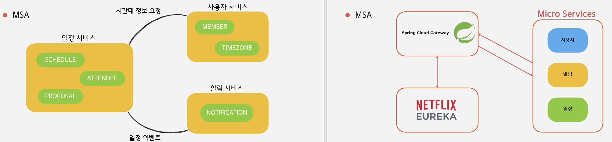
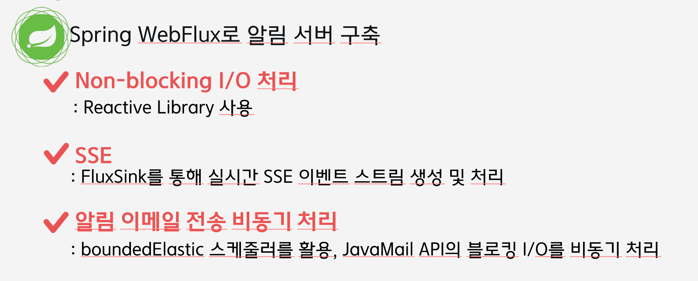
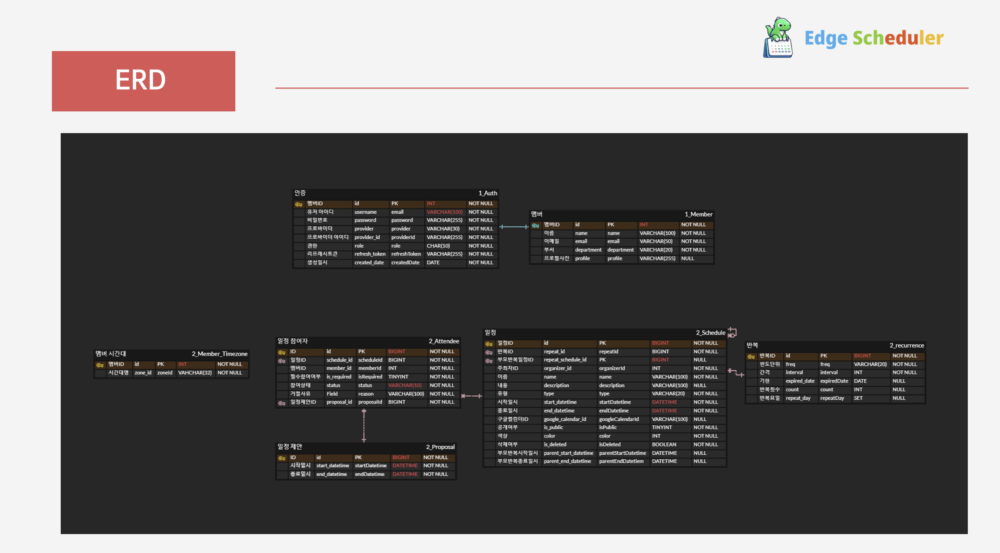
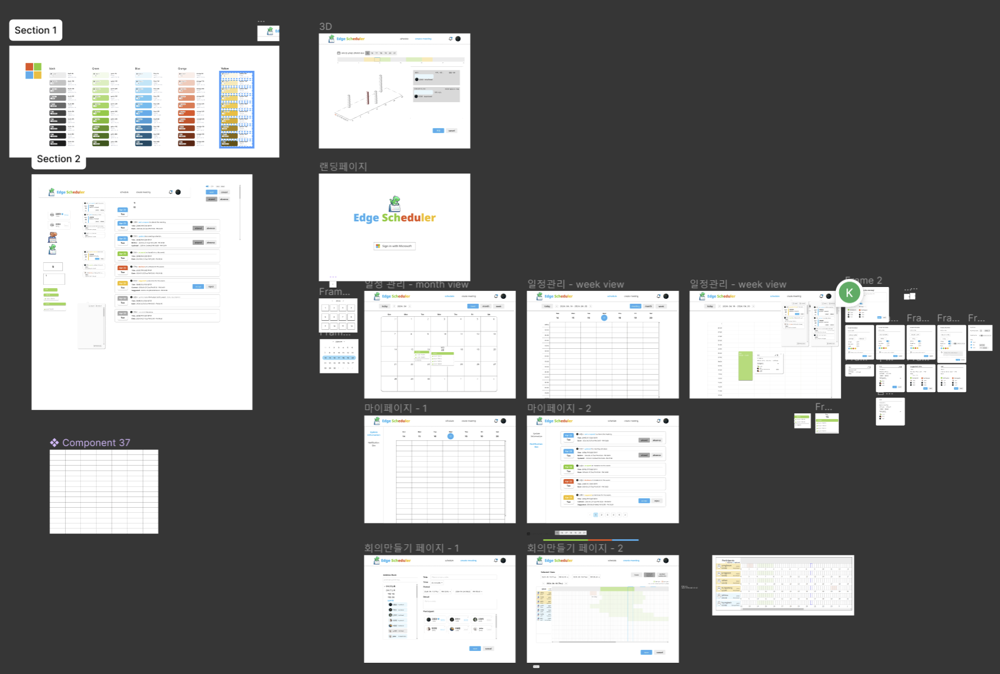

# Edge Scheduler

> SSAFY 10기 자율 프로젝트 서울 1반 Edge Scheduler (2024.04.08 ~ 2024.05.20)


<br/>

# 📜 목차

##### 1️⃣ [서비스 소개](#-서비스-소개)

##### 2️⃣ [서비스 화면](#-서비스-화면)

##### 3️⃣ [개발 환경](#-개발-환경)

##### 4️⃣ [기술 특이점](#-기술-특이점)

##### 5️⃣ [기획 및 설계 산출물](#-기획-및-설계-산출물)

##### 6️⃣ [Conventions](#-conventions)

##### 7️⃣ [팀원 소개 및 개발 회고](#-팀원-소개-및-개발-회고)

<br/>

# 서비스 구경 🎈

### [배포 사이트](https://edgescheduler.co.kr)

### 📌 Overview

- 글로벌 기업을 위한 **글로벌 회의 일정 추천 서비스**

### 🎯 기획 배경

> 세계 각지에 흩어져 있는 팀원들과 함께 일할 때 **시차**로 인한 **불편사항** 발생

> 회의 일정 고려 시, **각 팀원들의 시차를 고려**한 시간대를 파악해야 하는 **번거로움**존재

> 일부 팀원들은 **이른 시간**에 일어나거나, **늦은 시간**까지 일을 해야하는 불편함 존재

> **팀원들의 피로도 상승**, **생산성과 업무 만족도 하락**

### 📌 서비스 기능

- 각 사용자는 **개인 일정**을 등록하여 관리할 수 있습니다.
- **month, week, day**별 일정을 조회할 수 있습니다.
- **반복 일정** 및 **비공개 일정**을 관리할 수 있습니다.
- 회의 생성 시, 참여자들의 **필참 여부**를 선택하여 **최적의 회의시간**을 추천받을 수 있습니다.
- 설정한 기간 내에서 **3가지 기준(가장 빠른 시간, 불참자가 가장 적은 시간, 근무시간 내 참여자가 가증 많은 시간)**으로 **최적의 회의시간**을 추천받을 수 있습니다.
- 회의 참여를 요청받은 참여자들은 **수락, 거절, 새로운 시간 제안**을 통해 자신의 참석여부를 결정할 수 있습니다.
- 새로운 시간을 제안하기 전에, **해당 시간 내에 가능한 인원 조회**기능을 이용할 수 있습니다.
- **드래그 기능**으로 쉽고 간편하게 회의 시간을 설정할 수 있습니다.
- **타임존 설정**을 통해 세계 어디에서나 편하게 시간 변환을 통해 서비스를 이용할 수 있습니다.
- **실시간 브라우저 알림**을 통해서 회의 생성, 수정 및 새로운 시간 제안에 대한 알림을 받아볼 수 있습니다.
- **이메일 알림**을 통해 사이트에 접속해 있지 않더라도 회의와 관련한 알림을 받아볼 수 있습니다.

- <br >

# 서비스 화면 🎬

|  |  |
| :------------------------------------: | :---------------------------------------------------------: |
|                 로그인                 |                    일정 등록, 수정, 삭제                    |

|  |  |
| :---------------------------------------------------------: | :---------------------------------------------------: |
|                       근무 시간 설정                        |                       회의 생성                       |

|  |  |
| :---------------------------------------------------: | :---------------------------------------------------: |
|                       회의 수락                       |                       회의 수정                       |

|  |  |
| :-------------------------------------------------------: | :---------------------------------------------------: |
|                회의 거절(새로운 시간 제안)                |                       회의 삭제                       |

---

<br />

# 개발 환경 🖥

## 🖱 Frontend


<br>


<br>

## 🖱 Backend


<br>


<br>


## 🖱 Infrastructure


## 🎨 UI/UX


<br>

## 👨‍👩‍👧 협업 툴

- <strong>형상 관리<br>
  
  

- <strong>이슈 관리<br>
  

- <strong>커뮤니케이션<br>
  
  
  
  <br>

<br />

# 기술 특이점 🧰

## 🖱 Frontend

- 1. 외부 라이브러리 사용 없이 **드래그 기능 및 캘린더 기능 구현**

- 2. NextJS 활용 SEO를 고려한 SSR방식 웹사이트 제작

- 3. NextJS 활용 데이터 캐싱으로 UX 향상

- 4. Zustand를 활용해 전역 상태 관리

- 5. refreshToken과 accessToken으로 로그인 로직 구현

## 🖱 Backend

### ✨ 1. MSA

<div align="start">

</div>

### ✨ 2. Event-Driven Architecture 구축

<div align="start">

</div>

### ✨ 3. 마이크로 서비스 서버별 DB 분리

<div align="start">

</div>

### ✨ 4. 비동기 알림 처리

<div align="start">

</div>
<br />

# 기획 및 설계 산출물 📁

### [Notion](https://cheddar-cloudberry-278.notion.site/Edge-Scheduler-d7a4abb7476b478dbfa09f8bdf23fcb0)

### 🏛 서비스 아키택처

<div align="start">

</div>

### 🛢︎ ERD

<div align="start">

</div>

### [📄 API 명세서](https://cheddar-cloudberry-278.notion.site/API-d58760b094f04775b51fe521ff9c8015?pvs=74)

<div align="start">

</div>

### [🎨 화면 설계서](https://www.figma.com/design/WZr1HQ1PfhMd3nINjNrb3b/%F0%9F%93%B0?node-id=0%3A1&t=Y5XH75ckJ86cDiE9-1)

<div align="start">

</div>

<br/>

# ✨ Conventions

## 📌코드 컨벤션

[🖱 Frontend Conventions](https://cheddar-cloudberry-278.notion.site/Front-End-a2593902d26b4a62b90f04ffff85bdf2)

[🖱 Backend Conventions](https://cheddar-cloudberry-278.notion.site/Back_End-0cc21c58164e4ee09214200a6b467416?pvs=74)

## 📌커밋 컨벤션

```
✨Feat : 새로운 기능 추가
🐛Fix : 버그 수정
📝Docs : 문서 수정
🗃️Style : 코드 포맷팅, 세미콜론 누락, 코드 변경이 없는 경우
♻️Refactor : 코드 리펙토링
✅Test : 테스트 코드, 리펙토링 테스트 코드 추가
💡Comment : 필요한 주석 추가 했을 경우
🎨Design : css나 디자인 변경, 이미지 추가 등
🚑Hotfix : 치명적인 버그 수정
👷Build : 배포 관련
🤝🏻Merge : f-기능명 into dev-frontend
```

<br />

# 팀원 소개 및 개발 회고 🐥

## 📆 프로젝트 기간

### 2024.04.08 ~ 2024.05.20

- 기획 및 설계(학습) : 24.04.08 ~ 24.04.18
- 프로젝트 구현 : 24.04.19 ~ 24.05.16
- 버그 수정 및 산출물 정리 : 24.05.17 ~ 24.05.19
- 코드 리팩토링 : 24.05.20 ~

<br />

## 🍑 팀원 소개

<table>
    <tr>
        <td height="140px" align="center"> <a href="https://github.com/hyunsoo10">
             <br><br> 👑 조현수 <br>(Back-End) </a> <br></td>
        <td height="140px" align="center"> <a href="https://github.com/pyeong114">
             <br><br> 👶🻠전ì€í‰ <br>(Back-End) </a> <br></td>
        <td height="140px" align="center"> <a href="https://github.com/HyeongtaekOh">
             <br><br> 👶🏻 오형택 <br>(Back-End) </a> <br></td>
        <td height="140px" align="center"> <a href="https://github.com/yhc-key">
            
            <br><br> 👶🏻 조용환 <br>(Front-End) </a> <br></td>
        <td height="140px" align="center"> <a href="https://github.com/kimjungkwang1">
             <br><br> 👶🻠김중광 <br>(Front-End) </a> <br></td>
        <td height="140px" align="center"> <a href="https://github.com/se2develop">
             <br><br> 👶🏻 노세희 <br>(Front-End) </a> <br></td>
    </tr>
    <tr>
        <td align="center"><br/></td>
        <td align="center"><br/></td>
        <td align="center"><br/></td>
        <td align="center"><br/></td>
        <td align="center"><br/></td>
        <td align="center"><br/></td>
    </tr>
</table>

## 🙌🏻 회고

##### **조현수**<br>

-

##### **전은평**<br>

-

##### **오형택**<br>

-

##### **조용환**<br>

-

##### **김중광**<br>

-

##### **노세희**<br>

-
